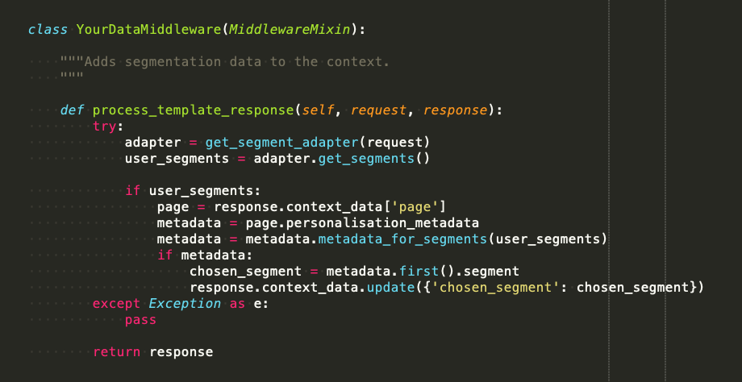

<!-----
NEW: Check the "Suppress top comment" option to remove this info from the output.

Conversion time: 2.024 seconds.

Using this Markdown file:

1. Paste this output into your source file.
2. See the notes and action items below regarding this conversion run.
3. Check the rendered output (headings, lists, code blocks, tables) for proper
   formatting and use a linkchecker before you publish this page.

Conversion notes:

* Docs to Markdown version 1.0β29
* Mon Aug 10 2020 13:04:48 GMT-0700 (PDT)
* Source doc: Untitled document

ERROR:
undefined internal link to this URL: "#heading=h.jbwtp6pkvycl".link text: active personal data
?Did you generate a TOC?

* Tables are currently converted to HTML tables.
* This document has images: check for >>>>>  gd2md-html alert:  inline image link in generated source and store images to your server. NOTE: Images in exported zip file from Google Docs may not appear in  the same order as they do in your doc. Please check the images!

----->

>>>>>  gd2md-html alert:  ERRORs: 1; WARNINGs: 0; ALERTS: 4.

<ul style="color: red; font-weight: bold"><li>See top comment block for details on ERRORs and WARNINGs. <li>In the converted Markdown or HTML, search for inline alerts that start with >>>>>  gd2md-html alert:  for specific instances that need correction.</ul>

Links to alert messages:
<a href="#gdcalert1">alert1</a>
<a href="#gdcalert2">alert2</a>
<a href="#gdcalert3">alert3</a>
<a href="#gdcalert4">alert4</a>

>>>>> PLEASE check and correct alert issues and delete this message and the inline alerts.

## **YourData: Developing front-end user-data-display tools**

[TOC]

## Abstract

The yourData project (yD) provides standards and patterns to facilitate the front-end display of personal data when it is used to customise digital content or services. We aim to help users easily see which of their data is at work in content personalisation processes on the same interface and at the same time that the instance of personalisation takes place.

The project is an open-source initiative seeking participation by actors from different disciplines to develop and implement this kind of transparency across digital platforms.

## Background

The web needs tools to show users how they are tracked and segmented, giving them easy visibility and control over the data and algorithms that shape what they see online.

This is motivated by the manifold problems that can arise when [people don’t understand how they are being targeted, how algorithms work and how their data is used](https://www.opendemocracy.net/en/digitaliberties/demand-data-transparency-everywhere-yourdata/).

As more systems employ user data, users are increasingly in the dark about the workings of services that they use and rely on. A properly informed public needs fluency in this domain to maintain critical engagement with the world, to challenge wrongdoing and to fully participate in our digital society.

Web services should help users understand these processes through effective, ethical design conventions.

## Principles

We believe the following principles around transparency and intelligible data usage promote user agency and encourage responsible product development.

**Transparency:** Service providers should seek to explain which of a user’s data is at work in a given interaction and how it is affecting the service. These are key aspects of how users experience the internet and society – opacity around these issues enables perverse outcomes and abuse, and leads to mistrust. 

**Intelligibility:** Web users should be able to easily understand which of their data is being used and how. Other details may also be considered important to display, for example where the data was collected i.e. the source. If the data and processes involved are too complex to show on a page, further information should be accessible for users who wish to dive deeper.

**Immediacy of intelligibility:** The relevant data and explanations should be made available to users at the same time that they receive the instance of personalisation that uses that data. They should understand why they are seeing certain content or services at the same time that they see those – the active personal data is necessary to help users fully interpret and act upon personalised content. Without this information being available at the moment of the interaction, the user is denied adequate information, agency and choice about how their data affects what they are being offered.

**User-centric design:** Web features are most effective when designed to fit user behaviour and expectations. Data transparency tools should be easy to find, intuitive to use, and readily available to users.

**Engagement:** Personalisation features can make websites more useful, enjoyable and convenient. We uphold the need for optimal engagement alongside the other principles, ensuring that transparency is employed such as to enhance user experience, by boosting online trust and developing the data fluency of web users as they traverse the complicated, modern web.

**Interoperability:** Standards should be open and interoperable with standard industry formats, where applicable. This supports widespread adoption by web service providers with the subsequent outcome of helping users easily understand how data is being used wherever they encounter data-driven services. Standards should be designed with varied digital systems in mind and should be accompanied by documentation and resources to enable adoption.

**Education:** This project is based on the idea that web technology should, where possible, assist users in understanding phenomena that affect their lives and experiences. Tools made in the spirit of yourData seek to inform users about each specific interaction, and simultaneously grow their confidence and familiarity with how data bears on digital systems more generally.

## The Future: Data transparency everywhere

Our vision is of an internet where people understand how their data is used to personalise digital services of all kinds. To that end, we seek to produce guidelines and design patterns that can be implemented on various services that use personal data to present content through a user interface.

## The yourData Project Overview

Whilst content personalisation, or targeting, is becoming more sophisticated and prevalent across the internet, there are far fewer efforts to ensure that this technology is built with transparency and user agency in mind.

yD is based on the idea that developing this technology with ethical design principles at heart can serve businesses and users better by boosting trust, whilst actively producing effective personalisation software.

At a technical level, most personalisation features are developed by product teams working towards engagement outcomes alone. Whilst there are relevant standards projects that seek to improve [data portability](https://datatransferproject.dev/), [service decentralisation](https://decentpatterns.xyz/), [user control of data](https://inrupt.com/solid), and other related goals, there is limited discussion of how personalisation should be conducted to enhance user agency.

yD addresses this gap by exploring specific personalisation software, coordinating feedback from experts and users, and synthesizing those into standards, recommendations and support networks. Through community activities, the yD community expects to learn about the development of tools and techniques to facilitate data transparency.

yD will establish standards that frame the development of intuitive transparency features in software such as content management systems.

These will be collaboratively produced within a community-driven, inclusive, multi-stakeholder process, by an interdisciplinary group of experts and users. This will help prioritise those data transparency scenarios that the community and users consider to be of practical importance.

We will showcase these standards through live implementations and subsequent user testing and design iterations. All re-usable code and research will be published open-source.

yD consists in a set of software standards and design patterns that guide developers of data and personalisation systems to produce interfaces that communicate a user’s data in meaningful ways.

This project will research and recommend the following elements, among others, to make this protocol applicable to a range of systems.

*   An[ ontology](https://www.w3.org/OWL/) of demographic user data to ensure clear and interoperable design of transparency features (example:[ Schema.org](https://schema.org/Person))
*   Guidelines and patterns for applying the ontology within software and frameworks e.g. CMSs
*   Process guidelines e.g. for integrating such a featureset into organisational GDPR activity
*   Graphical assets, such as the yourData icon, to familiarise users with the protocol and how to use it, thus increasing data accessibility
*   A list of projects which effectively implement yourData on other systems e.g. Django / Wagtail

Such resources will be designed to support new and existing managers of personalisation systems to work towards greater transparency ideals. 

The open-source ecosystem emerging from this transparency focused effort should also enable product innovation and diversity through interoperability.

We contend that a significant degree of industry-wide data transparency can be achieved through harmonization of existing products. However, we recognise that the field is complex, with data, data sources, and processing methods (e.g. algorithms) coming in very many forms that can be difficult to describe to developers let alone the general public. In light of that, we consider this to be a research effort which seeks solutions to simpler examples so as to build a body of knowledge applicable to more advanced scenarios later. The realm of data science will only become more complex over time – this should not dissuade us from seeking ways to communicate it to citizens whose lives depend on it.

This paper details the technical basis of the yourData Project. We publish in open-source formats for greater accessibility.

Use Cases

Any system that offers services or content on the basis of personal data may find useful guidance from the yD framework. From managing user data in a compatible way, to presenting active personal data to users in a front-end design or service interface, yD provides recommendations that help achieve uniformity, thus intelligibility, across digital services.

The first use case considered by the project will be personalised content on media websites, as managed by project leader openDemocracy. Other examples include e-commerce, e-government and anything that employs user data in preparing content.

Further examples can be found here: [https://www.opendemocracy.net/en/digitaliberties/your-data-makes-web-personal/](https://www.opendemocracy.net/en/digitaliberties/your-data-makes-web-personal/)

## Protocol recommendations

To improve the transparency of personalisation systems, yD makes recommendations in the following areas. This is an overview of each area, with links to implementation resources and further explanations that are available elsewhere. We seek to make this as abstract as possible, so as to provide guidance to a wide variety of systems, whilst making it sufficiently specific to be actionable.

Each of these can be considered systematically in the case of each personalisation system or feature i.e. this acts as a tick-list for features seeking to meet the yD standard.

Dependent on your system and data stack, it may not be easy to fulfil all of these immediately – they can be viewed as aspirations to be met over time as you make efforts to improve the transparency of your system.

1. **Data meets taxonomy standard**

**Rationale**

Personal data used in personalisation can be heterogeneous and come from many different sources. This complicates efforts to process and communicate it to wider audiences. To support a more universally-intelligible, ethical set of categories for user data, and to contribute to interoperability between yD-aware systems, we recommend that data meets person data standards.

**Steps to implement**

Survey user data collection systems e.g. cookies, CMS, CRM, data-brokers that you use to personalise content and identify sources and formats of data used.

For example, if your CMS obtains a browser-based cookie in order to attribute location, gender and interest data to a user, we recommend exploring how that data is stored by that system. If possible, change the data model to meet the yD specification, or prepare to parse the data to match the yD person taxonomy at a later stage in the process.

We propose to extend the [https://schema.org/Person](https://schema.org/Person) taxonomy. This is an appropriate basis for defining web users but lacks much of the detail and categories employed by modern personalisation.

**Further comments**

Data sources for personalisation are complex and often not in the full control of the website administrator (e.g. where third-party data brokers supply and manage user data) which can act as a blocker to the fulfillment of this recommendation. This can be remedied over time by promoting this recommendation in appropriate ways, for example by explaining to your data broker that you intend to meet this standard and suggesting that they also seek to abide by the protocol or, alternatively, by migrating to another data source that does meet these standards.

2. **Data passed to user interface**

**Rationale**

Many systems ingest user data (e.g. from a web page request) and return a response (e.g. content for a web page) without the data that was used to prepare that response. The response content therefore does not contain information about the personalisation process. Attaching that data to the response is a key aspect of achieving transparency.

**Steps to implement**

Data is prepared during the process of personalisation, per user, for display in the front-end of different pages.

This can be achieved with middleware or some other relevant part of your application logic.

For example, in the Wagtail Personalisation module, user data such as location data is used to pick a content segment that matches the user’s profile. In a version lacking transparency-awareness, the module just passes the content back based on the segment once the data has been used to select the segment. We can add that data to the response simply by passing it along, in a yD-compatible format, with the response to be used by a HTML template.

3. **Data presented in user-facing template**

**Rationale**

Once appropriately formatted data has been made available by the personalisation logic, it should be presented on the front end in a suitable way. This may involve paying attention to clarity of presentation within HTML, accessibility concerns, and information architecture.

To help users understand the data on the front-end without adding avoidable friction, we aim to style data in a simple and elegant fashion, using recognisable elements where possible.

**Steps to implement**

The data contained in the attributes should say what type of information was used and the source but not the actual data used unless that can be done securely (i.e. authenticated user who knows that their data will be shown to them on site).

We would possibly use HTML attributes on an element that contains personalised content. This is a standard approach to encoding attributes on front-end elements e.g. [ARIA accessibility data](https://developer.mozilla.org/en-US/docs/Web/Accessibility/ARIA).

If possible, use the yD icon to enable familiarity across the web.

If possible, use standardised visual language and CSS. We offer re-usable HTML and CSS patterns to assist with this. 

## Personalisation system design

The following outlines the specific elements of a typical personalisation experience and considers how we might apply the protocol recommendations to it. This maps out key actions and concepts involved in building such a system.

Let’s take the example of an article page where localised content is shown to users in location X and not shown to others. The system gets the user’s location data and then personalises the content before displaying it to the user. The following stages, at least, occur in this process. We mark out where the above protocol recommendations might apply the workflow along the way.

### Stages of web personalisation

1. User makes request to visit web page from browser
2. Website receives the user’s request.
3. The request includes the user’s IP address which implies a geographic location. The website may alternatively check a cookie on the user’s browser to attribute data to the user, or discover identifying information by other means.

**> Data meets taxonomy standard**

    The website should parse the geographic location (or any other user data) according to the yD-recognised data taxonomy. That might involve ensuring that the IP address is mapped to a country according to a standard list of countries (e.g. the two-letter[ ISO country code](http://en.wikipedia.org/wiki/ISO_3166-1) as referenced here [https://schema.org/Country](https://schema.org/Country)).

4. Website checks what information should be shown to the user according to its personalisation rules and passes this as a response.

**> Data passed to user interface**

    The data used for personalisation gets explicitly passed in the response ready to be shown to the user. For example, in a CMS like Django, this might involve a middleware file ensuring that the data is packaged up with the response context.

5. Website shows personalised web page to the user. One or more elements are personalised, possibly including a) the primary content feed, b) an advert banner, c) an internal promotional box linking to another part of the site.

**> Data presented in user-facing template**

    The data is displayed with a simple front-end element designed to frictionlessly explain how the data was used and why it is being shown.

6. User views the web page in browser

### Possible extra steps

7. User views their data element or visits personal settings page on site that can show some of their data held or used by the site.
8. User makes subject data access request (as per GDPR) to understand how their data has been used.

### Case study: Personalised content on a media site

openDemocracy is a media website publishing and curating content to global audiences. Personalisation can be used on site to show readers more relevant articles and information. In doing so, web design features may be implemented which quickly allow users to see which of their data are used by hovering over the yourData transparency icon. This icon reveals a popup explaining what user data was employed to select this content for this user.

_Impression of yourData popup on openDemocracy home page._

The following is a list of actions involved in developing such a tool in accordance with yD. This was done whilst forking the Wagtail CMS’s personalisation package, [http://wagxperience.io](http://wagxperience.io).

An existing, early version of this can be viewed at: [https://www.opendemocracy.net/en/digitaliberties/yourdata-helping-you-see-data-in-action](https://www.opendemocracy.net/en/digitaliberties/yourdata-helping-you-see-data-in-action/)

*   Survey user data collection systems which are used to personalise content. Identify sources and formats of data used for personalisation. This data is parsed according to universally compatible data taxonomy which can easily interface with various content systems.
    *   IP address observed in request, [parsed by Cloudflare and supplied to Wagtail/Django](https://support.cloudflare.com/hc/en-us/articles/200168236-Configuring-Cloudflare-IP-Geolocation) app as country code with the CF-IPCountry request header in accordance with ISO standard.
*   Data is prepared, during the instance of personalisation, per user, for easy visibility on the front-end, for different pages and different widgets.
    *   The response is captured by a dedicated piece of middleware and sent back for the user with the relevant data to be displayed with a given widget.

*   Style data on the front-end in an elegant fashion. Use yD icon to enable familiarity across the web. Use standardised visual language and CSS.
    *   We apply simple, clean, unobtrusive design elements.

This is an initial application of yD. Subsequent implementations will apply the standard more rigorously. For example, we may consider more standards-compliant ways of presenting data in HTML markup with a yD-specific data attribute in the style of ARIA.

From left to right, this is how data flows through an implementation of this on Wagtail CMS.

<table>
  <tr>
   <td><strong>1) User data source</strong>
   </td>
   <td><strong>2) CMS middleware</strong>
   </td>
   <td><strong>3) Front-end templates</strong>
   </td>
  </tr>
  <tr>
   <td>Web request data (e.g. geo-IP)
   </td>
   <td><a href="https://github.com/wagtail/wagtail-personalisation/">Wagtail-personalisation</a> (forked)
   </td>
   <td>Django / <a href="http://jinja.pocoo.org">jinja</a>
   </td>
  </tr>
</table>

### Data Models

#### **Taxonomy**

It is unclear if an existing taxonomy standard suits the role of categorising data that is used in web personalisation. Ideally, such a taxonomy should at least capture the main types commonly in use by such systems and be extensible so as to capture data types that emerge in future.

If such a standard does not exist, this may be something we wish to establish as part of this project.

Example standards:

[https://schema.org/Person](https://schema.org/Person)

This diagram hints at other categories that may exist in a future taxonomy relevant to personalisation: [https://panoptykon.org/sites/default/files/3levels.png](https://panoptykon.org/sites/default/files/3levels.png)

### **Existing solutions**

We offer here a quick overview of some existing, though limited, solutions which are indicative of the state of the art. We intend to maintain this list to gain a comprehensive view on what exists and to avoid duplicate effort (we invite contributors to submit other entries here).

#### **Websites and software**

We take the view that there is no existing tool that gives sufficient, simple visibility to web users about which of their data is being used to serve content. We understand this to be true of live web sites and services, and also of software packages (e.g. Wordpress CMS) that could be used to easily offer such a facility to webmasters.

<table>
  <tr>
   <td><strong>Service / software</strong>
   </td>
   <td><strong>Feature</strong>
   </td>
   <td><strong>Notes</strong>
   </td>
  </tr>
  <tr>
   <td>Facebook
   </td>
   <td>https://www.facebook.com/help/1701730696756992
   </td>
   <td>
<ul>

<li>Requires entering “Settings” so is cumbersome to use

<li>Proprietary software
</li>
</ul>
   </td>
  </tr>
  <tr>
   <td>Google
   </td>
   <td>https://myactivity.google.com/privacyadvisor/search
   </td>
   <td>
<ul>

<li>Proprietary software
</li>
</ul>
   </td>
  </tr>
  <tr>
   <td>Apple
   </td>
   <td>https://www.alphr.com/apple/1008957/apple-icon-collecting-data
   </td>
   <td>
<ul>

<li>Proprietary software
</li>
</ul>
   </td>
  </tr>
</table>

### Contribute to the Core Framework

We are keen for collaborators, contributors, sponsors and supporters of all sorts.

Please log any issues on our Github repository: 

Please email any enquiries to matthew.linares -@- opendemocracy.net

### Resources

**DjangoLondon Presentation 2019 – Data Transparency on Django with yourData **[https://skillsmatter.com/skillscasts/14632-data-transparency-on-django-with-yourdata](https://skillsmatter.com/skillscasts/14632-data-transparency-on-django-with-yourdata)

### Glossary

##### **Active personal data** 

Personal data that is actively used during an instance of personalisation to decide what content or services should be offered to a user.

##### **User engagement**

The state of a user being involved in an online activity such that they are focussed on that activity. Such a state is viewed as desirable in web development and serves as a success metric.

##### **Third-party data**

[https://digiday.com/media/what-is-third-party-data](https://digiday.com/media/what-is-third-party-data)
